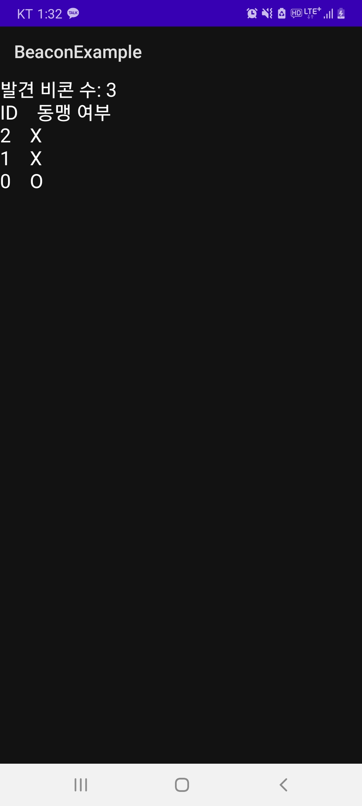
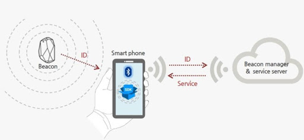

# 비콘이란  
- 근거리에 있는 스마트 기기를 자동으로 인식하여 필요한 데이터를 전송할 수 있는 무선 통신 장치  
- Bluetooth Low Energy(BLE, Bluetooth 4.0부터 포함된 통신 기술) 적용하여 저전력이고 일방향  
- 광고, 위치 추정(신호 강도 기반으로 측정하며 정확도는 낮음) 등에 사용  

# 종류 (31 바이트)  
- iBeacon (Apple) UUID, Major ID, Minor ID
- Eddystone (Google)
   - Types  
     - Eddystone-UID  
     - Eddystron-URL  
     - Eddystone-TLM (배터리 상태 등)  
- Altbeacon (Radius Networks) Beacon ID
   - 오픈소스, iBeacon과 비슷하며 더 유연  

``` 검색 결과, iBeacon을 많이 사용하는 편 ```  

# 라이브러리  
- AltBeaconandroid-beacon-library(Apache 2.0 License) AltBeacon(기본), iBeacon, Eddystone 등 다양한 비콘 형식에 적용 가능  
- Android 제공 블루투스 API  

# 개발 시 필요사항  

- 실제 사용하는 비콘 장비  
- BLE 지원 스마트폰 + Beacon Simulator APP(Freeware) 또는 자체 제작 앱  
- BLE 지원 Windows 10 PC + Beacon Simulator, Quick Beacon 프로그램(iBeacon 형식만 지원, Freeware) 또는 자체 제작 프로그램 (AltBeaconwindows-beacon-library, C#)  
   - Bluetooth가 없을 경우, USB Bluetooth 사용 가능 (가격 5,000 ~ 10,000)  
- 아두이노 또는 라즈베리 파이를 사용한 테스트 비콘 제작  
   - 아두이노 단일 보드 마이크로컨트롤러로 완성된 보드와 관련 개발 도구 및 환경  
     - 아두이노 보드 R3(약 10,000) + 블루투스 모듈(약 5,000) = 대략 15,000  
   - 라즈베리 파이 초소형초저가 컴퓨터  
     - 라즈베리파이 4 Model B(약 50,000)  

# 개발 예제  

- 비콘을 인식하여 인증하는 앱 (iBeacon, Altbeacon 인식)  

- 실행화면  

<p align="center"><p>  

- 구성도  

<p align="center"><p>  

- 코드 (Altbeacon Library Sample Code 참조)  

```java
public class RangingActivity extends Activity implements BeaconConsumer {
    protected static final String TAG = "RangingActivity";
    private BeaconManager beaconManager;

    @Override
    protected void onCreate(Bundle savedInstanceState) {
        super.onCreate(savedInstanceState);
        setContentView(R.layout.activity_ranging);
        beaconManager = BeaconManager.getInstanceForApplication(this);
        // To detect proprietary beacons, you must add a line like below corresponding to your beacon
        // type.  Do a web search for "setBeaconLayout" to get the proper expression.
        // beaconManager.getBeaconParsers().add(new BeaconParser().
        //        setBeaconLayout("m:2-3=beac,i:4-19,i:20-21,i:22-23,p:24-24,d:25-25"));
        beaconManager.bind(this);
    }
    @Override
    protected void onDestroy() {
        super.onDestroy();
        beaconManager.unbind(this);
    }
    @Override
    public void onBeaconServiceConnect() {
        beaconManager.removeAllRangeNotifiers();
        beaconManager.addRangeNotifier(new RangeNotifier() {
            @Override
            public void didRangeBeaconsInRegion(Collection<Beacon> beacons, Region region) {
                if (beacons.size() > 0) {
                    // 비콘 인식
                }
            }
        });

        try {
            beaconManager.startRangingBeaconsInRegion(new Region("myRangingUniqueId", null, null, null));
        } catch (RemoteException e) {    }
    }
}
```